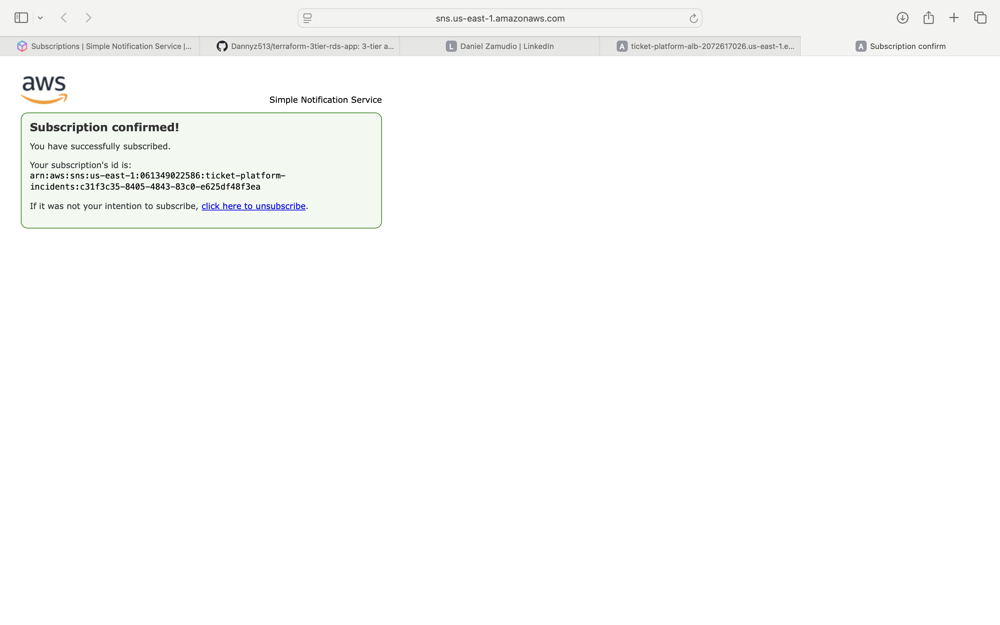
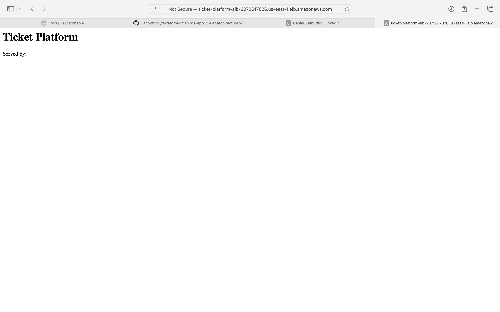
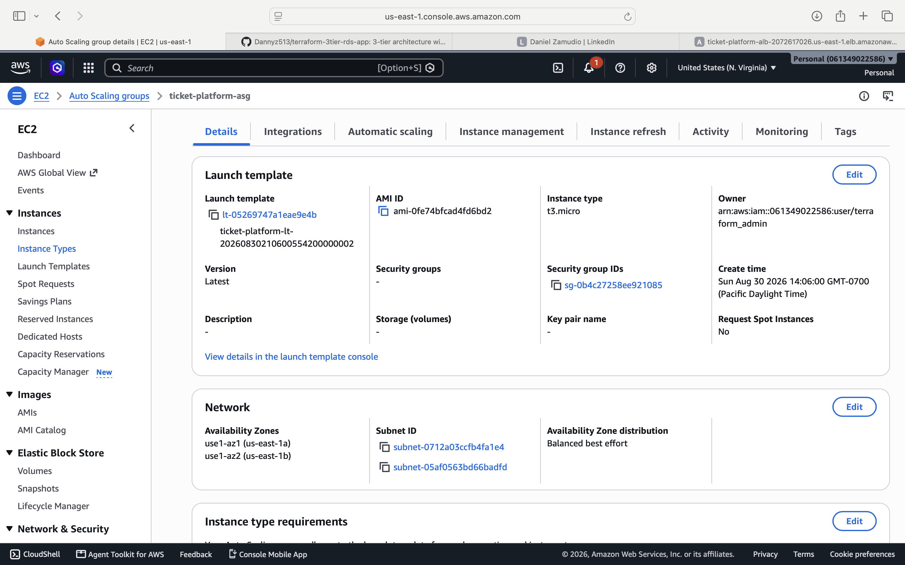
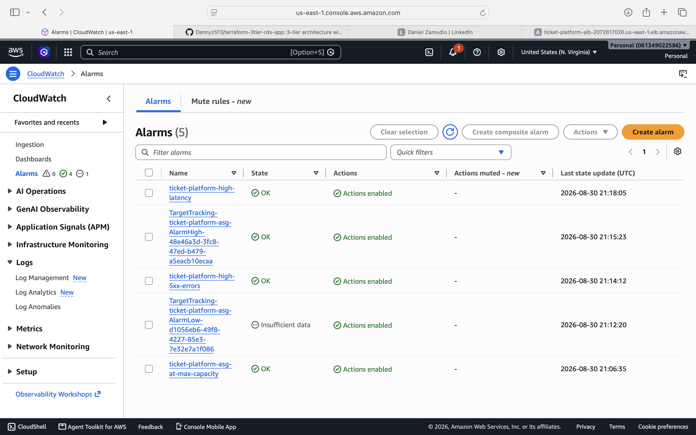
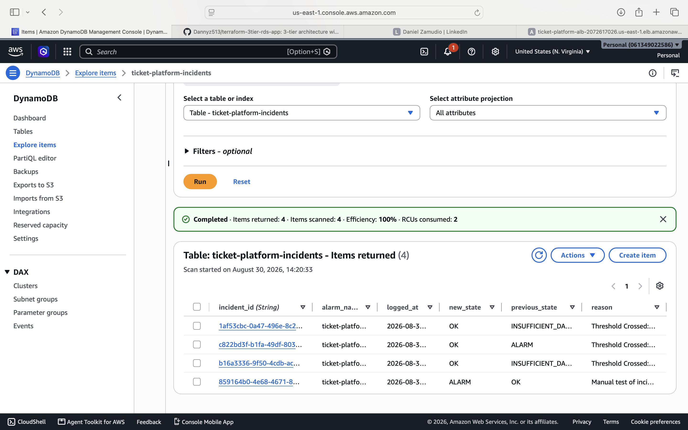

# 🎟️ How I Would Architect Infrastructure for a Company Like SeatGeek

> This is a design exercise based on SeatGeek's publicly known business model — ticket on-sales that spike traffic 50-100x in minutes — not a claim about their actual internal infrastructure, which I have no visibility into.

A capstone project bringing together auto-scaling, monitoring, and automated incident response into one coherent system: infrastructure that stays lean in steady state, scales *ahead of* known traffic spikes (not just reactively), and turns every alarm into a permanent, queryable record instead of a notification someone might miss.

**Full design document, including trade-offs and what I'd change at 10x scale:** [`DESIGN.md`](./DESIGN.md)


---

## The Problem

A ticket marketplace has two traffic regimes: calm, steady-state browsing most of the year, and a handful of on-sale events where traffic spikes 50-100x within minutes. Infrastructure needs to handle both without over-provisioning for peak 365 days a year — and when something actually goes wrong, that needs to be more than a Slack ping that gets missed at 2am during a launch.

## Architecture

- **VPC** across 2 Availability Zones — ALB in public subnets, application tier in private subnets
- **Two scaling mechanisms working together:**
  - **Target-tracking scaling on ALB request count per target** — reacts to real load faster than CPU-based scaling, which lags behind an actual traffic surge
  - **Scheduled scaling**, pre-warming capacity ahead of a known on-sale time — because reactive scaling alone is too slow for a spike arriving in under a minute
- **CloudWatch Alarms** on the signals that actually indicate a problem: p99 latency (3 consecutive breaching periods, to avoid alarming on noise), 5xx error rate, and the ASG hitting max capacity (a leading indicator of insufficient capacity planning)
- **SNS** for immediate human notification
- **EventBridge Rule** capturing every alarm state change, routing to **Lambda**
- **Lambda → DynamoDB**: every alarm becomes a permanent, structured incident record — timestamp, alarm name, state transition, and reason — supporting postmortems and trend analysis instead of relying on someone's inbox

## Key Design Decisions (see DESIGN.md for full reasoning)

- **Why request-count-per-target instead of CPU-based scaling?** CPU is a lagging indicator; request count reacts to load directly.
- **Why scheduled *and* reactive scaling?** For a known on-sale time, waiting for reactive metrics to breach a threshold wastes the exact seconds that matter most.
- **Why EventBridge → Lambda → DynamoDB instead of just SNS?** A notification is transient. A database record is permanent and queryable — supporting real postmortems, not just "someone probably saw the alert."
- **Why a single AWS region, not one per event location?** Ticket buyers aren't geographically tied to the venue — a concert in LA is bought by people nationwide. Region selection should be driven by where users are and what consistency guarantees the system needs (avoiding a real overselling risk from cross-region inventory writes), not by matching infrastructure to event geography. Full reasoning in DESIGN.md, section 6a.

## AWS Well-Architected Framework Alignment

| Pillar | How this design addresses it |
|---|---|
| Reliability | Multi-AZ, ASG maintains desired capacity, health-check-based replacement |
| Performance Efficiency | Request-count scaling responds to real load, not a proxy metric |
| Operational Excellence | Every alarm becomes a structured, permanent record — not tribal memory |
| Cost Optimization | Steady-state stays small; peak capacity only provisions when actually needed |
| Security | Least-privilege IAM — the incident-logging Lambda can only write to its one table |

## Deliberately Out of Scope

A senior design states what's excluded and why, rather than pretending the design is complete. Full reasoning in DESIGN.md — briefly: multi-region failover (cost/complexity not yet justified), WAF/Shield Advanced (a distinct problem space from this project's scaling/alerting focus), caching layer and read replicas (natural next iteration), and a dashboard UI for the incident log (DynamoDB is queryable directly for this project's purposes).

## Proof It Works

**SNS subscription confirmed:**


**The app, live behind the load balancer:**


**Auto Scaling Group and instances:**


**A manually-triggered alarm, proving the detection layer works:**


**The same alarm, automatically logged as a permanent incident record:**


## Usage

```bash
terraform init
terraform plan
terraform apply
```

Confirm the SNS subscription email, then test the incident pipeline:
```bash
aws cloudwatch set-alarm-state --alarm-name ticket-platform-high-latency --state-value ALARM --state-reason "Manual test"
aws dynamodb scan --table-name ticket-platform-incidents
```

Tear down when finished:
```bash
terraform destroy
```

## Cost

ALB (~$0.0225/hr) and NAT Gateway (~$0.045/hr) are the main hourly costs; DynamoDB, Lambda, EventBridge, and SNS are all pay-per-use and negligible at this scale. Roughly $0.07/hr (~$1.70/day) if left running continuously.

## Tech Stack

**Terraform** 1.15 · **AWS** (ALB, Auto Scaling, CloudWatch, EventBridge, Lambda, DynamoDB, SNS, IAM) · **Python**
